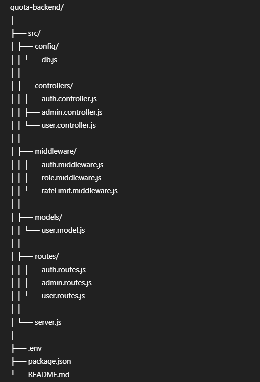

# 📊 Quota-Based Request Management System (Backend)

A **Node.js + Express + MongoDB** backend system that manages **user API request quotas** with authentication, authorization, rate limiting, auto reset, and expiry handling.

---

## 🚀 Project Overview

This project implements a **quota-limited API access system** where:

- Users authenticate using **JWT**
- Admin assigns **request quotas**
- Each API request **consumes quota**
- Requests are blocked when quota is exceeded
- Quota **auto-resets**
- Accounts **expire automatically**
- API usage is **logged**
- Rate limiting prevents abuse

---

## 🛠️ Tech Stack

- **Backend:** Node.js, Express.js  
- **Database:** MongoDB (Mongoose)  
- **Authentication:** JWT  
- **Security:** Role-based access control  
- **Rate Limiting:** express-rate-limit  
- **Testing:** Postman  

---

## 📂 Project Folder Structure

---

---

## 🔐 Authentication & Authorization

- JWT-based authentication
- Roles:
  - `ADMIN`
  - `USER`
- Middleware ensures secure access control

---

## 🔢 Quota System Features

- Each user has a fixed quota
- Each API request reduces quota by **1**
- Requests are blocked when quota reaches **0**
- Quota resets automatically
- Account expiry handling
- Usage logs are maintained

---

## ⏱️ Rate Limiting

- Prevents abuse
- **5 requests per minute per user**
- Implemented using `express-rate-limit`

---

## 🌐 API Endpoints

### 🔹 Health Check

---

### 🔹 Authentication APIs

POST /api/auth/register
POST /api/auth/login

---

### 🔹 Admin APIs (ADMIN only)
POST /api/admin/users
GET /api/admin/users
DELETE /api/admin/users/:id
---

### 🔹 User APIs
GET /api/user/quota
PUT /api/user/use-quota

## 🧪 Testing (Postman)

Steps followed:

1. Register admin
2. Login admin → get JWT
3. Create users with quota
4. Login user → get JWT
5. Use quota API
6. Verify quota decrement
7. Test quota exceeded condition
8. Test rate limiting
9. Test auto reset & expiry

✔️ All APIs tested successfully using **Postman**

---

## ✅ Key Highlights

- RESTful API design
- Secure JWT authentication
- Role-based authorization
- Quota + rate limit protection
- Production-ready architecture

---

## 📌 Conclusion

This project demonstrates real-world **API quota management**, similar to systems used by SaaS platforms.

---

## 👨‍💻 Author

**Ajith Jayya Surya**  
B.Tech – CSE (AI & Data Analytics)
